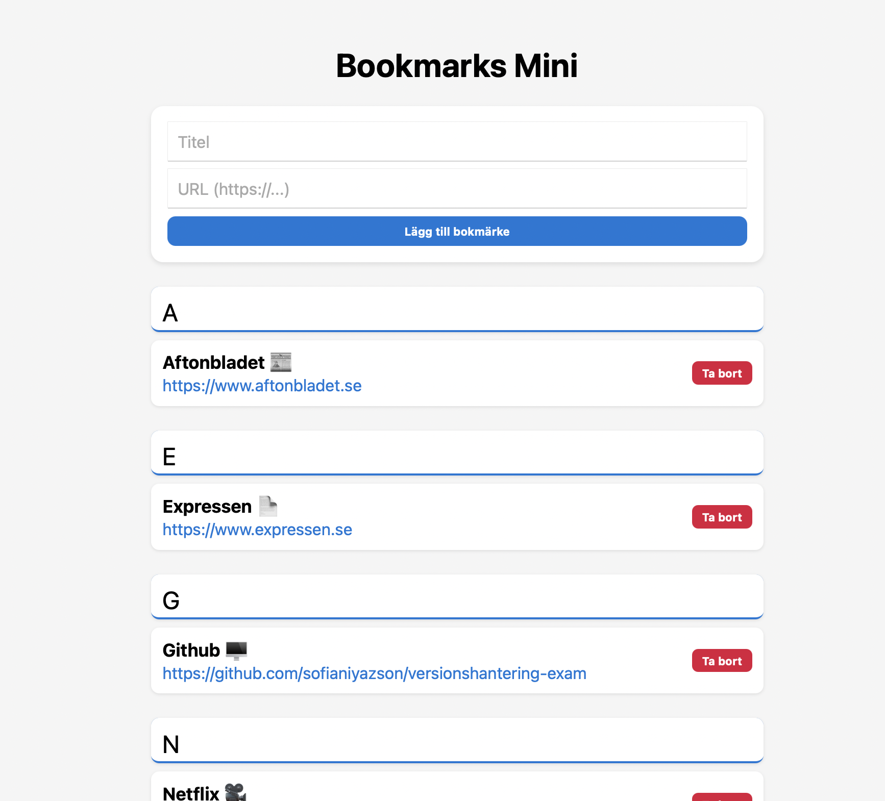

# 📚 Bokmärken (Bookmarks Mini)

En enkel webbsida där användaren kan spara, visa och hantera sina bokmärken.  
Projektet är byggt med **HTML, CSS och JavaScript** och syftet är att träna på DOM-manipulation, events och localStorage.



## ✨ Funktioner
- ➕ Lägg till bokmärke (titel + URL)  
- 📋 Visa sparade bokmärken i en lista  
- 🔗 Öppna bokmärken i ny flik  
- 🗑️ Ta bort bokmärken  
- 💾 Bokmärken sparas automatiskt i webbläsarens localStorage
- 🧮 Alfabetiskt strukturerad

## 🛠️ Tekniker
- **HTML** – struktur  
- **CSS** – layout och design  
- **JavaScript** – logik och lagring i localStorage

## 🎯 Syfte
Att träna på Scrum och Versionshantering med Git samtidigt och förstår hur man använder **Trello**korten. Hur man skapar **PR**, AC, DoD och även UserStories. Reviewa andras PullRequest och ge förslag på förbättring på dessa.

## 🗂️ Trello-bräda
👉 [📑 Trello-bräda](https://trello.com/b/lMLk8cHJ/versionshantering-examination)


## ↗️💭 Hänvisningar (VG)
Förbättringsförslag som **jag** har **fått**:

- 1️⃣) Förbättring 1 stöds av PR/commit: <https://github.com/sofianiyazson/versionshantering-exam/pull/6>
- 2️⃣)Förbättring 2 stöds av PR/commit: <https://github.com/sofianiyazson/versionshantering-exam/pull/3>

Förbättringsförslag som **jag** har **gett** till andra: 
- 1️⃣) Förbättring 1 stöds av PR/commit: <https://github.com/moodyambr/Individuell-examination-Git-Agilt/pull/1>
- 2️⃣)Förbättring 2 stöds av PR/commit: <https://github.com/moodyambr/Individuell-examination-Git-Agilt/pull/4>

## 🛠️ Mergekonflikten
[🧩 ➡️ PR-Konflikten med kommentar om hur jag löste den, även en skärmbild på mergekonflikten](https://github.com/sofianiyazson/versionshantering-exam/pull/7)


## 🚧 Utmaningar & lösningar

### 🧩 Utmaning:
- När jag råkade inkludera 2 st PRs på ena, bara för att jag inte ville vänta tills reviewen var klar. Det var helt mardröm. Jag satt försökte rebase min feat/US7-Visible-link branch i main. Det gick inte igenom. Sedan försökte jag göra en seperat commit med PR men det funkade inte heller. Fick panik och försökte lösa det.

**💡 Lösning:**

- Lösningen var att jag inte hade gjort **git pull** på main branchen för att hämta lokalt ändringar, så jag trodde hela tiden att koden inte hade pushats. Så jag satt och pushade hela tiden samma commit även om den redan fanns i origin. 

---


## 🚀 Installation
Om du vill köra projektet lokalt:

```bash
# Klona repot
git clone https://github.com/sofianiyazson/versionshantering-exam

# Öppna mappen
cd .starter

# Öppna i webbläsaren
open index.html